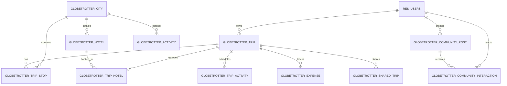

# GlobeTrotter — Database Design & Schema Specification

GlobeTrotter uses PostgreSQL 17 with an Odoo-compliant relational data model.

---

## 1. Entity-Relationship Diagram (ERD)

---

## 2. Table Specifications

### 2.1 `res_users` (User Accounts & Travel DNA)
| Column | Type | Constraints | Description |
| :--- | :--- | :--- | :--- |
| `id` | SERIAL | PRIMARY KEY | Unique user ID |
| `name` | VARCHAR(128) | NOT NULL | Full name |
| `first_name` | VARCHAR(64) | NULL | First name |
| `last_name` | VARCHAR(64) | NULL | Last name |
| `email` | VARCHAR(128) | UNIQUE, NOT NULL | Login email address |
| `password_hash` | VARCHAR(256) | NOT NULL | PBKDF2-SHA256 password hash |
| `phone` | VARCHAR(32) | NULL | Contact phone number |
| `city` | VARCHAR(64) | NULL | Residence city |
| `country` | VARCHAR(64) | NULL | Residence country |
| `role` | VARCHAR(32) | DEFAULT 'traveler' | Access role (`traveler`, `admin`) |
| `preferred_currency` | VARCHAR(8) | DEFAULT 'INR' | Currency (`INR`, `USD`, `EUR`, `GBP`, `AED`, `SGD`) |
| `preferred_travel_style` | VARCHAR(32) | DEFAULT 'balanced' | Style (`balanced`, `budget`, `luxury`, `adventure`, `relaxed`, `family`, `solo`, `business`) |
| `avatar_url` | VARCHAR(256) | NULL | Profile photo URL |
| `additional_info` | TEXT | NULL | Travel bio & notes |
| `bio` | TEXT | NULL | Traveler bio manifesto |

---

### 2.2 `globetrotter_trip` (Itinerary Root)
| Column | Type | Constraints | Description |
| :--- | :--- | :--- | :--- |
| `id` | SERIAL | PRIMARY KEY | Unique trip ID |
| `user_id` | INTEGER | REFERENCES res_users(id) ON DELETE CASCADE | Owner user |
| `name` | VARCHAR(128) | NOT NULL | Trip title |
| `start_date` | DATE | NOT NULL | Start date |
| `end_date` | DATE | NOT NULL | End date |
| `total_budget` | NUMERIC(12,2) | DEFAULT 0.00 | Target financial budget |
| `travelers_count` | INTEGER | DEFAULT 1 | Number of travelers |
| `currency` | VARCHAR(8) | DEFAULT 'INR' | Trip currency |
| `travel_style` | VARCHAR(32) | DEFAULT 'balanced' | Target travel style |
| `cover_image` | VARCHAR(256) | NULL | Cover banner image URL |
| `description` | TEXT | NULL | Trip overview description |
| `is_public` | BOOLEAN | DEFAULT FALSE | Public visibility flag |
| `share_budget` | BOOLEAN | DEFAULT TRUE | Include budget in shared view |
| `share_token` | VARCHAR(64) | UNIQUE, NULL | Unguessable sharing token |

---

### 2.3 `globetrotter_trip_stop` (Route Sequence)
| Column | Type | Constraints | Description |
| :--- | :--- | :--- | :--- |
| `id` | SERIAL | PRIMARY KEY | Unique stop ID |
| `trip_id` | INTEGER | REFERENCES globetrotter_trip(id) ON DELETE CASCADE | Parent trip |
| `city_id` | INTEGER | REFERENCES globetrotter_city(id) | Target destination |
| `sequence` | INTEGER | DEFAULT 1 | Order in route |
| `arrival_date` | DATE | NULL | Arrival date |
| `departure_date` | DATE | NULL | Departure date |
| `nights` | INTEGER | DEFAULT 1 | Duration of stay |
| `notes` | TEXT | NULL | Stop notes |

---

### 2.4 `globetrotter_trip_activity` (Scheduled Sections & Activities)
| Column | Type | Constraints | Description |
| :--- | :--- | :--- | :--- |
| `id` | SERIAL | PRIMARY KEY | Unique activity item ID |
| `trip_id` | INTEGER | REFERENCES globetrotter_trip(id) ON DELETE CASCADE | Parent trip |
| `stop_id` | INTEGER | REFERENCES globetrotter_trip_stop(id) ON DELETE SET NULL | Associated destination stop |
| `name` | VARCHAR(128) | NOT NULL | Title of activity or item |
| `section_type` | VARCHAR(32) | DEFAULT 'activity' | Type: `activity`, `transport`, `hotel`, `food`, `event`, `free_time`, `custom` |
| `day_number` | INTEGER | NOT NULL, DEFAULT 1 | Itinerary day assignment |
| `scheduled_time` | VARCHAR(16) | DEFAULT '10:00' | Time slot |
| `category` | VARCHAR(32) | DEFAULT 'sightseeing' | Category (`sightseeing`, `food`, `culture`, `adventure`, `nature`, `relaxation`, `shopping`, `transport`) |
| `estimated_cost` | NUMERIC(10,2) | DEFAULT 0.00 | Cost |
| `duration_hours` | NUMERIC(4,2) | DEFAULT 2.0 | Duration in hours |
| `location_address` | VARCHAR(256) | NULL | Address / landmark |
| `notes` | TEXT | NULL | Booking refs / notes |

---

### 2.5 `globetrotter_hotel` & `globetrotter_trip_hotel` (Accommodations)
* `globetrotter_hotel`: Curated catalog of accommodations with star ratings, cost per night, location/cleanliness/service sub-scores, amenities list, and category.
* `globetrotter_trip_hotel`: Relational reservation link tying a hotel to a trip stop, check-in/out dates, guest/room count, room type, and automatically linked `globetrotter_expense` record.

---

### 2.6 `globetrotter_community_post` (Community Stories & Hub)
| Column | Type | Constraints | Description |
| :--- | :--- | :--- | :--- |
| `id` | SERIAL | PRIMARY KEY | Unique post ID |
| `author_id` | INTEGER | REFERENCES res_users(id) ON DELETE CASCADE | Post author |
| `title` | VARCHAR(256) | NOT NULL | Story title |
| `city_id` | INTEGER | REFERENCES globetrotter_city(id) ON DELETE SET NULL | Associated destination |
| `travel_style` | VARCHAR(32) | DEFAULT 'adventure' | Travel style |
| `rating` | NUMERIC(3,1) | DEFAULT 5.0 | Overall rating |
| `estimated_cost` | NUMERIC(10,2) | DEFAULT 0.00 | Total trip spend |
| `cover_image` | VARCHAR(256) | NULL | Cover image URL |
| `content` | TEXT | NOT NULL | Travel story & tips narrative |
| `tags` | JSONB / TEXT[] | DEFAULT '[]' | Tags list |
| `highlights` | JSONB | DEFAULT '[]' | Curated activities list for 1-Click Import |
| `likes_count` | INTEGER | DEFAULT 0 | Total likes |
| `saves_count` | INTEGER | DEFAULT 0 | Total saves |

---

### 2.7 `globetrotter_community_interaction` (Likes & Bookmarks)
| Column | Type | Constraints | Description |
| :--- | :--- | :--- | :--- |
| `id` | SERIAL | PRIMARY KEY | Unique interaction ID |
| `user_id` | INTEGER | REFERENCES res_users(id) ON DELETE CASCADE | User |
| `post_id` | INTEGER | REFERENCES globetrotter_community_post(id) ON DELETE CASCADE | Community post |
| `interaction_type` | VARCHAR(16) | NOT NULL | `like` or `save` |
| `created_at` | TIMESTAMP | DEFAULT CURRENT_TIMESTAMP | Timestamp |
| *Constraint* | UNIQUE(user_id, post_id, interaction_type) | Prevents duplicate reactions |
